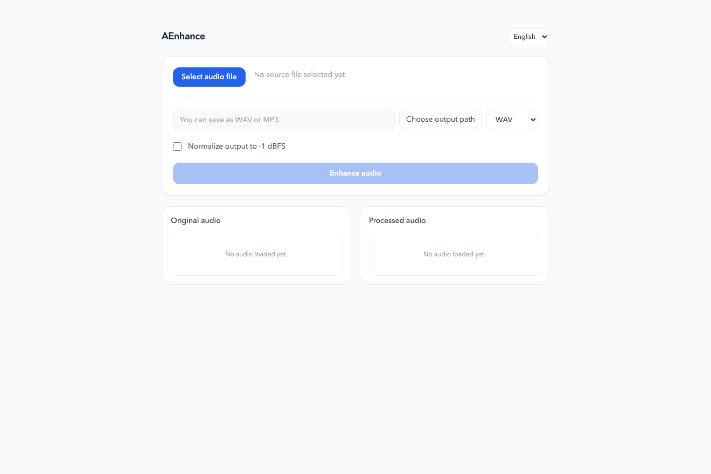
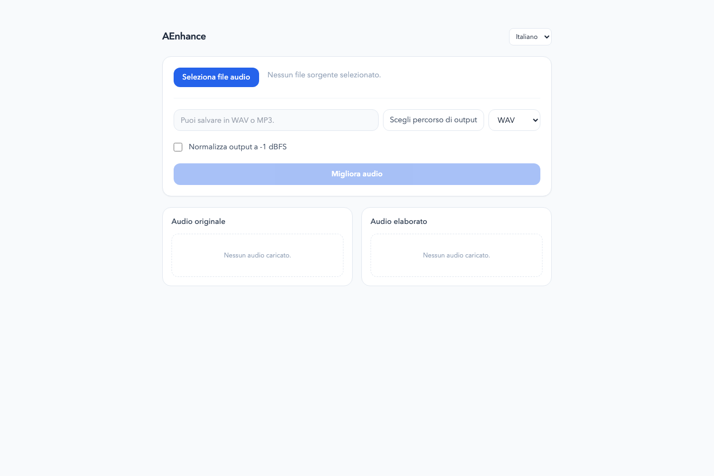
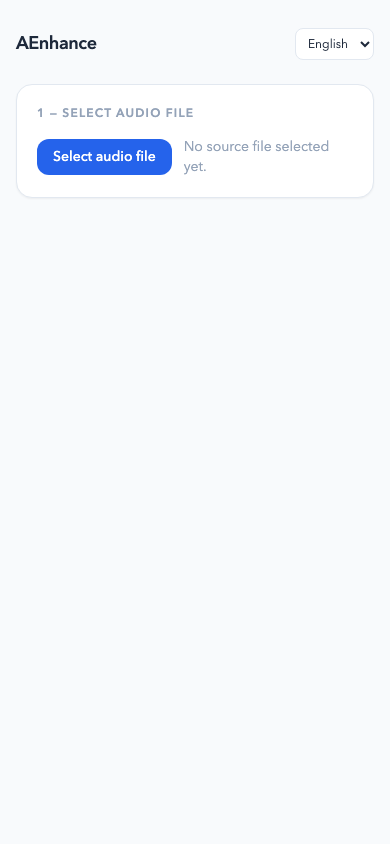
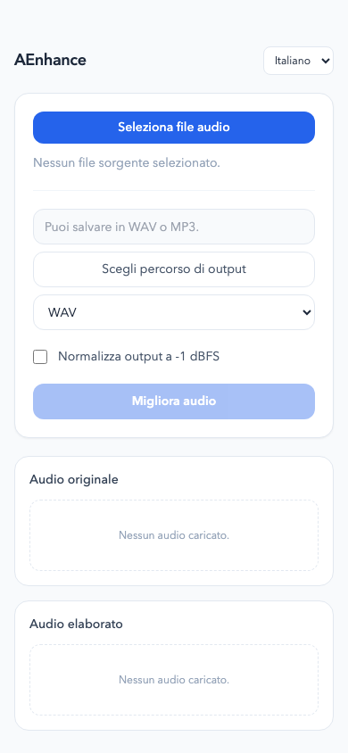

# AEnhance

A desktop app for AI-powered audio noise reduction, built with Tauri 2, Vue 3, and RNNoise (nnnoiseless).

## Features

- **Noise reduction** — removes background noise using the RNNoise neural network (nnnoiseless)
- **Peak normalization** — optional normalization to −1 dBFS after denoising
- **Volume boost** — post-processing gain adjustment (0–20 dB) without re-running the denoiser
- **WAV and MP3 output** — WAV is built-in; MP3 export requires FFmpeg
- **Real-time progress** — per-frame progress events during denoising
- **Cancellable** — stop the process at any time mid-frame
- **Waveform preview** — WaveSurfer.js waveform for both the original and processed file
- **English / Italian UI**

## Screenshots

### Desktop

| English | Italian |
|---------|---------|
|  |  |

### Mobile

| English | Italian |
|---------|---------|
|  |  |

> Run `npm run screenshots` to regenerate (requires the dev server to be running).

## Requirements

- [Node.js](https://nodejs.org/) (LTS)
- [Rust](https://rustup.rs/) + Cargo
- [Tauri prerequisites](https://tauri.app/start/prerequisites/) for your OS
- [FFmpeg](https://ffmpeg.org/) — only needed for MP3 export

## Development

```bash
npm install
npx tauri dev
```

## Build

```bash
npx tauri build
```

Produces platform-native bundles (`.dmg` on macOS, `.msi`/`.exe` on Windows, `.deb`/`.AppImage` on Linux) in `src-tauri/target/release/bundle/`.

## Tests

**Frontend** (Vitest):
```bash
npm test
```

**Backend** (Rust):
```bash
cd src-tauri && cargo test
```

## Tech stack

| Layer | Technology |
|-------|-----------|
| Frontend | Vue 3 (`<script setup>`), Tailwind CSS v3, WaveSurfer.js v7 |
| Backend | Rust, Tauri 2 |
| Audio | symphonia (decode), nnnoiseless/RNNoise (denoise), hound (WAV write) |
| i18n | vue-i18n (English, Italian) |
